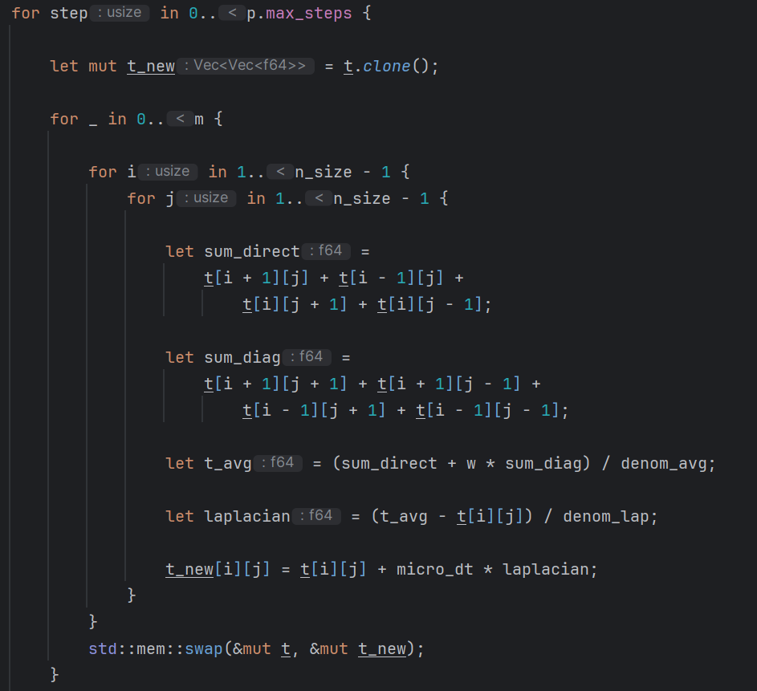
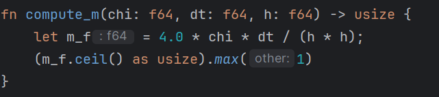
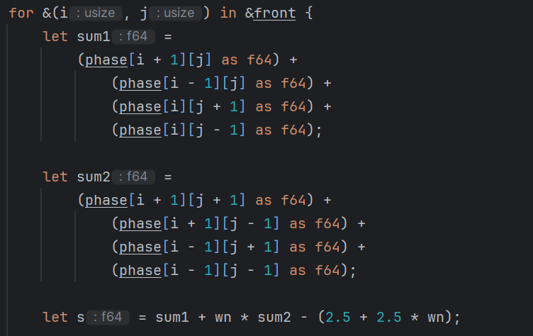
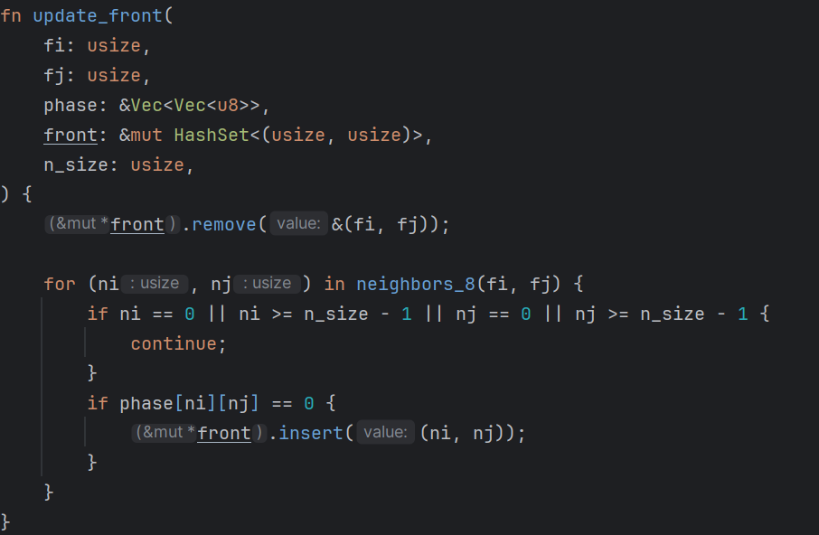
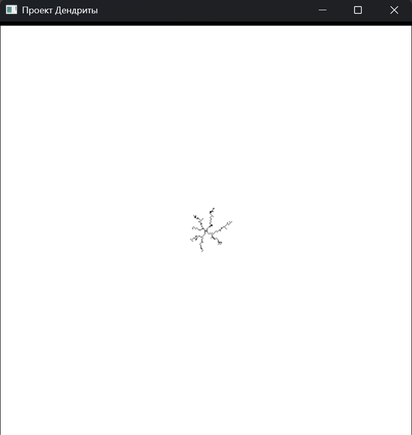
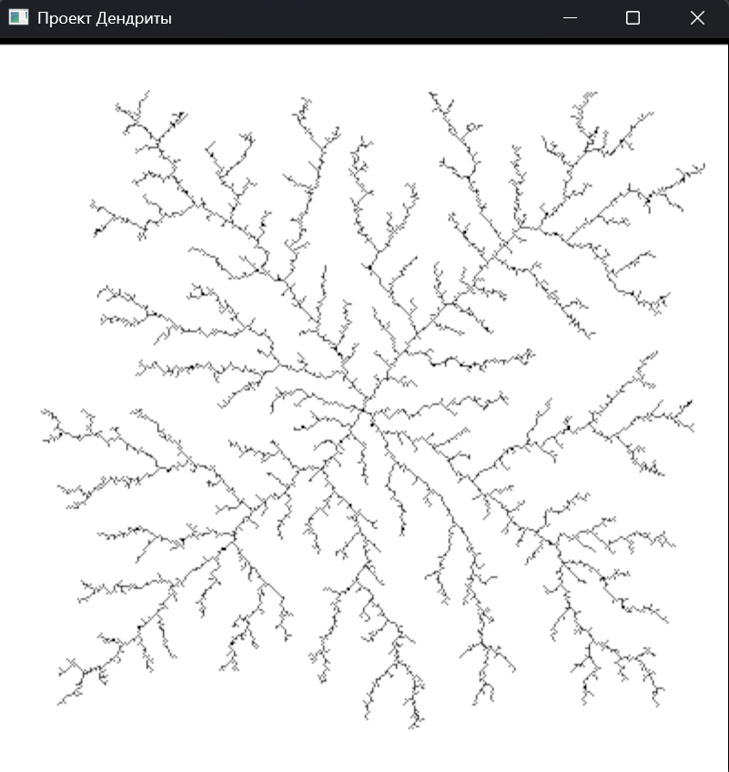
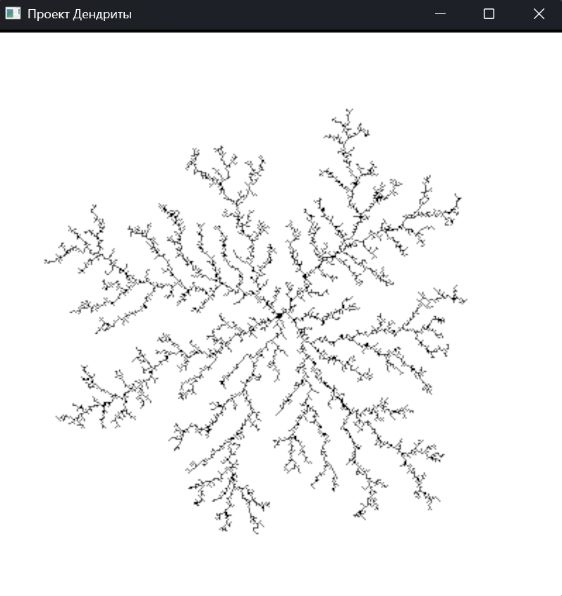
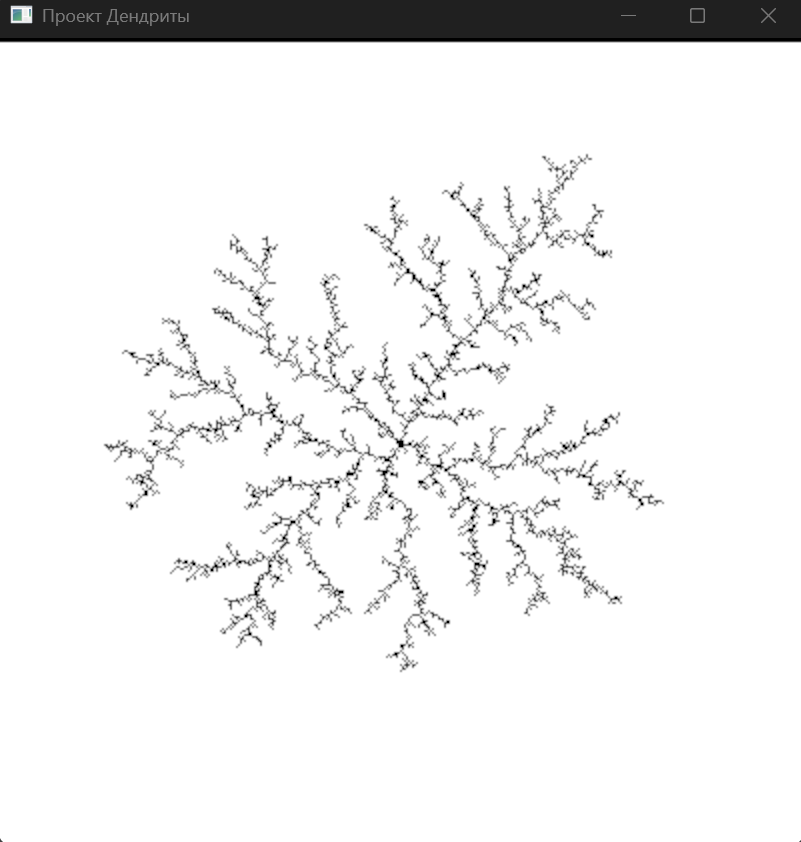

Рассмотрим итоги

<!--more-->

# Введение

На предыдущем этапе проекта была сформулирована дискретная алгоритмическая
модель роста дендритных кристаллов. В её основу легли фундаментальные уравнения
теплопроводности, термодинамический критерий фазового перехода, дискретная
аппроксимация кривизны интерфейса и механизм стохастических флуктуаций.
Задача настоящего, третьего этапа состоит в том, чтобы перейти от математической
схемы к работающей программной реализации, проверить её устойчивость,
устранить выявленные в ходе отладки артефакты и провести серию вычислительных
экспериментов для различных металлов.

Дендритный рост является одним из наиболее характерных явлений при
кристаллизации расплавов. Он определяется конкуренцией двух факторов: движущей
силы, задаваемой переохлаждением расплава, и стабилизирующего вклада
поверхностного натяжения. В условиях, когда диффузия тепла значительно быстрее
продвижения фронта кристаллизации, плоская граница раздела фаз оказывается
неустойчивой. Небольшие выступы на фронте попадают в область с более высоким
температурным градиентом и начинают расти быстрее, чем соседние участки. Этот
механизм, известный как неустойчивость Муллинса–Секерки, приводит к
разветвлённой, древовидной морфологии кристалла.

Воспроизведение этого механизма в дискретной вычислительной модели
потребовало тщательного согласования временных и пространственных масштабов,
выбора физически обоснованных параметров, а также введения анизотропии
поверхностной энергии — без которой, как показала практика, получить дендритную
морфологию в клеточной сетке принципиально невозможно.

Реализация выполнена на языке Rust. Этот выбор обусловлен несколькими
факторами. Во-первых, Rust обеспечивает производительность, сопоставимую с C и
C++, без сборщика мусора и с детерминированным управлением памятью. Во-вторых,
строгая система типов языка позволяет на этапе компиляции исключить целый класс
ошибок, характерных для численных программ. В-третьих, оптимизированная сборка
`--release` даёт ускорение в 10–20 раз по сравнению с отладочной, что принципиально
важно для расчётов на сетках размером 401×401 с тысячами временных шагов.

# Архитектура программной реализации

Программа структурирована по принципу чёткого разделения физических данных
и вычислительного алгоритма. На верхнем уровне находятся две ключевые структуры
данных: `Material` и `SimParams`.

Структура `Material` инкапсулирует все физические характеристики моделируемого
вещества. В неё входят плотность $\rho$ (кг/м³), удельная теплоёмкость $c$
(Дж/(кг·К)), теплопроводность $k$ (Вт/(м·К)), удельная скрытая теплота
кристаллизации $L$ (Дж/кг), температура плавления $T_m$ (K) и поверхностная
энергия $\gamma$ (Дж/м²). Все производные физические величины, необходимые для
расчёта, вычисляются непосредственно из этих параметров через методы структуры.
Такой подход позволяет легко переключаться между материалами, не изменяя
вычислительного ядра. ([рис. @fig-001]).

{#fig-001 width=70%}

Структура `SimParams` содержит численные параметры, которые управляют
поведением модели: размер сетки $N$, шаг сетки $h$ (м), глобальный временной шаг
$\Delta t$ (с), весовые коэффициенты $w$ и $w_n$ для диагональных соседей, коэффициент
капиллярной поправки $\lambda$, амплитуду шума $\delta$, параметр анизотропии
$\varepsilon$, масштабирующий коэффициент скрытой теплоты `latent_factor` и
начальную температуру $T_{initial}$. Разделение физических и численных параметров
принципиально важно: оно позволяет исследовать влияние каждой группы параметров
независимо. ([рис. @fig-002]).

{#fig-002 width=70%}

Основная функция `simulate()` принимает ссылки на обе структуры и возвращает
матрицу фазовых состояний после завершения расчёта. Внутри функции реализован
главный вычислительный цикл, состоящий из нескольких последовательных этапов:
пересчёта температурного поля, анализа фронта кристаллизации и применения
фазового перехода. Для отслеживания активного фронта используется коллекция
`HashSet`, в которую помещаются только те жидкие ячейки, которые непосредственно
граничат с кристаллической фазой. Это позволяет избежать полного обхода сетки на
каждом шаге и сосредоточить вычислительные ресурсы там, где происходит рост.

# Реализация теплопроводности

Математическую основу блока теплопроводности составляет явная
конечно-разностная схема интегрирования уравнения теплопроводности. На каждом
глобальном шаге расчёт разбивается на $m$ микро-шагов, каждый из которых
обновляет температурное поле по формуле

$$
T^{new}_{i,j} = T_{i,j} + \frac{\chi \Delta t}{m} \nabla^2 T,
$$

где $\chi = k / (\rho c)$ — коэффициент температуропроводности. Для никеля это
значение составляет около $2.3 \times 10^{-5}$ м²/с, для алюминия — около
$9.8 \times 10^{-5}$ м²/с, для меди — около $1.16 \times 10^{-4}$ м²/с.

Дискретный лапласиан вычисляется через взвешенное среднее температур
окрестности. В расчёт включаются как четыре прямых соседа, так и четыре
диагональных, вклад которых регулируется коэффициентом $w$:

$$
\langle T_{i,j} \rangle =
\frac{\sum T_{\text{прямые}} + w \sum T_{\text{диагональные}}}{4 + 4w}.
$$

Разность между этим средним и текущей температурой узла представляет собой
дискретный аналог оператора Лапласа:

$$
\nabla^2 T \approx
\frac{\langle T_{i,j} \rangle - T_{i,j}}{(4 + 4w)(1 + 2w) h^2}.
$$

Именно эта формула стоит в сердце блока теплопроводности и реализована во
внутреннем цикле по всем узлам сетки. ([рис. @fig-003]).

{#fig-003 width=70%}

Устойчивость явной схемы определяется условием Куранта–Фридрихса–Леви. Для
двумерного уравнения теплопроводности оно имеет вид

$$
\frac{\chi \Delta t}{m h^2} < \frac{1}{4}.
$$

Отсюда следует, что количество микро-шагов должно удовлетворять условию

$$
m \geq \left\lceil \frac{4 \chi \Delta t}{h^2} \right\rceil.
$$

В программе $m$ вычисляется автоматически при каждом запуске на основе
текущих значений $\chi$, $\Delta t$ и $h$. Это гарантирует, что условие устойчивости
соблюдается при любом выборе параметров. ([рис. @fig-004]).

{#fig-004 width=70%}

Важным наблюдением, сделанным в ходе разработки, стало следующее: при слишком
малом $\Delta t$ диффузионная длина за один шаг оказывается меньше размера ячейки.
В этом случае тепло практически не перераспределяется между шагами роста, и фронт
не «ощущает» влияния удалённой среды. Это приводит к баллистическому, а не
диффузионному росту. Для получения дендритной морфологии необходимо, чтобы
$\Delta t$ было достаточно большим — порядка $10^{-6}$ с для никеля при $h = 10^{-6}$
м, что даёт $m \approx 100$ микро-шагов и обеспечивает эффективное
перераспределение тепла.

# Реализация фазового перехода

Фазовый переход реализован в несколько этапов. На каждом глобальном шаге
алгоритм анализирует все ячейки, входящие в множество фронта, и определяет, какие
из них должны перейти в твёрдое состояние на текущем шаге.

Первое условие — пространственное: ячейка должна иметь хотя бы одного
кристаллического соседа. Это условие уже обеспечивается самой структурой фронта,
поэтому отдельная проверка не требуется.

Второе условие — термодинамическое. Оно связано с локальным
переохлаждением, то есть разностью между температурой плавления и текущей
температурой ячейки:

$$
\Delta T_{local} = T_m - T_{i,j}.
$$

Чем больше это значение, тем сильнее движущая сила кристаллизации в данной точке.

Кривизна интерфейса учитывается через параметр $s$, вычисляемый по формуле

$$
s = \sum_1 n_{i,j} + w_n \sum_2 n_{i,j}
- \left(\frac{5}{2} + \frac{5}{2} w_n\right),
$$

где $\sum_1$ и $\sum_2$ обозначают суммы фазовых маркеров прямых и диагональных
соседей соответственно. Параметр $s$ является дискретной аппроксимацией
кривизны $1/R$: положительные значения соответствуют вогнутым участкам, где
кристаллизация энергетически выгодна, отрицательные — выпуклым. ([рис. @fig-005]).

{#fig-005 width=70%}

Стохастическая составляющая вводится через случайную величину $\eta \in [-1, 1]$,
которая на каждом шаге и для каждой ячейки генерируется независимо. Это
моделирует термодинамические флуктуации, неизбежно присутствующие на
межфазной границе и провоцирующие нарушение симметрии.

Вероятность роста ячейки вычисляется как

$$
P = \frac{\Delta T_{local} + \eta \delta - \lambda_{eff} s}
{\Delta T_{macro}},
$$

где $\Delta T_{macro} = T_m - T_{initial}$ — начальное переохлаждение всей системы.
Вероятность ограничивается снизу нулём и сверху единицей. Ячейка переходит в
твёрдое состояние, если равномерно распределённое случайное число оказывается
меньше $P$.

При заморозке ячейки её температура повышается на величину, пропорциональную
скрытой теплоте кристаллизации:

$$
T_{i,j} \leftarrow T_{i,j} + \alpha \cdot \frac{L}{c},
$$

где $\alpha$ — масштабирующий коэффициент, учитывающий особенности
двумерной геометрии. Использование полного значения $L/c$ (для никеля около
670 К) приводило к тепловому взрыву на интерфейсе и немедленному подавлению роста.
После ряда экспериментов было установлено, что значение $\alpha \approx 0.2$
обеспечивает физически разумный нагрев интерфейса и позволяет получить
устойчивый диффузионный рост.

Обновление множества фронта производится сразу после заморозки каждой ячейки.
Замёрзшая ячейка удаляется из фронта, а все её жидкие соседи добавляются. Это
гарантирует, что на следующем шаге будут рассмотрены только актуальные
кандидаты на кристаллизацию. ([рис. @fig-006]).

{#fig-006 width=70%}

# Учёт анизотропии поверхностной энергии

Одной из ключевых проблем, выявленных в ходе разработки, стало отсутствие
дендритной структуры при полностью изотропной постановке задачи. В изотропном
случае все направления роста равноправны, и единственной устойчивой формой
кристалла в такой системе является круг — или, в случае квадратной сетки, квадрат.
Никакое сочетание параметров переохлаждения, капиллярности и шума не приводило
к ветвлению, пока не была введена анизотропия.

Физический смысл анизотропии поверхностной энергии состоит в следующем: в
реальных кристаллах поверхностная энергия $\gamma$ зависит от кристаллографической
ориентации. Грани с низкой энергией растут медленнее, чем грани с высокой
энергией. Для кубических кристаллов, к которым относятся никель, алюминий и медь,
характерна четырёхкратная симметрия.

В дискретной модели анизотропия введена через зависимость капиллярного
коэффициента от угла нормали к фронту:

$$
\lambda_{eff} = \lambda \left(1 + \varepsilon \cos 4\theta \right),
$$

где $\theta$ — угол нормали, $\varepsilon$ — параметр анизотропии. При $\varepsilon = 0$
система изотропна. При $\varepsilon > 0$ появляются четыре предпочтительных
направления роста вдоль осей сетки.

Угол нормали вычисляется через дискретный градиент фазового поля:

$$
\theta = \arctan\left(\frac{\partial n / \partial y}{\partial n / \partial x}\right).
$$

Дискретная аппроксимация градиента реализована центральными разностями по
прямым соседям.

В ходе экспериментов было установлено, что величина $\varepsilon$ существенно
влияет на морфологию. При малых значениях ($\varepsilon \approx 0.01$) анизотропия
присутствует, но слаба — форма всё ещё близка к кругу. При $\varepsilon \approx 0.05$
чётко выражены четыре главных луча. При $\varepsilon > 0.1$ структура становится
нефизичной: вместо дендрита формируется узкий крест из четырёх игл без каких-либо
боковых ветвей.

Именно введение этого механизма стало переломным моментом в разработке: сразу
после его реализации модель перешла от квадратного роста к выраженной
дендритной морфологии.

# Граничные условия

Выбор граничных условий оказался нетривиальной задачей. В простейшей
постановке на всех четырёх сторонах сетки фиксировалась начальная температура
расплава $T_{initial}$ — так называемое условие Дирихле:

$$
T\big|_{\partial \Omega} = T_{initial}.
$$

Физически это означает, что граница является идеальным термостатом, поддерживающим
постоянную температуру. Пока дендрит невелик и не достигает края сетки, это условие
не влияет на его морфологию. Однако при достижении границы возникал серьёзный
артефакт: фронт начинал интенсивно расти вдоль стенки, образуя чёрный ободок
по всему периметру изображения.

Причина эффекта физически прозрачна. Граница с фиксированной температурой
выступает бесконечным источником переохлаждения: сколько бы тепла ни выделяла
кристаллизующаяся ячейка, граница немедленно «поглощает» его и возвращает
температуру к $T_{initial}$. В результате фронт у стенки всегда находится в условиях
максимального переохлаждения и растёт с максимальной скоростью.

Для устранения артефакта было применено граничное условие Неймана:

$$
\frac{\partial T}{\partial n}\bigg|_{\partial \Omega} = 0.
$$

Физически оно означает нулевой тепловой поток через границу, то есть теплоизолированную
стенку. В дискретной реализации граничные ячейки просто копируют температуру своего
ближайшего внутреннего соседа.

После этого изменения рост вдоль стенки прекратился. При достижении границы
дендрит просто упирался в неё, а не продолжал расти вдоль края. Это соответствует
физически более реалистичному поведению в конечной области.

# Система визуализации

Для отображения результатов моделирования была использована система
визуализации, разработанная в рамках дисциплины «Компьютерная графика»
в предыдущем семестре. Это решение позволило существенно сократить время,
затраченное на разработку интерфейса, и сосредоточиться на физической и
численной стороне задачи.

Система основана на построении растрового изображения фазового поля: каждая
ячейка матрицы отображается в соответствующий пиксель. Кристаллическая фаза
закрашивается чёрным цветом, жидкая — белым. ([рис. @fig-007]).

{#fig-007 width=70%}

Простота цветовой схемы позволила сразу визуально оценить морфологию кристалла,
заметить артефакты и контролировать ход роста. На ранних стадиях отладки именно
визуальный анализ помогал быстро выявлять проблемы: взрывной рост, квадратную
форму, чёрные стенки — всё это было немедленно видно по картинке, без необходимости
анализировать числовые данные.

# Оптимизация вычислений

Задача моделирования дендритного роста вычислительно нетривиальна. При сетке
размером 401×401 и 5000 глобальных шагов, каждый из которых включает порядка
100 микро-шагов теплопроводности, общее число операций обновления температуры
составляет порядка $10^{10}$. Без специальной оптимизации расчёт такого масштаба
может занимать многие часы.

Наиболее значимым шагом по ускорению стал переход к сборке `--release`. В Rust
отладочная сборка намеренно отключает все оптимизации компилятора и добавляет
проверки переполнения, что замедляет выполнение в 10–30 раз по сравнению с
оптимизированной версией. После перехода к `cargo run --release` расчёт на сетке
401×401 за 5000 шагов стал занимать порядка нескольких минут, что вполне
приемлемо для целей проекта.

Вторым важным решением стал отказ от полного обхода сетки при проверке условий
фазового перехода. Вместо итерации по всем $N^2$ ячейкам алгоритм обходит только
множество фронта — жидкие ячейки, непосредственно граничащие с кристаллом.
Размер этого множества в типичных расчётах составляет несколько сотен — несколько
тысяч ячеек, что на два-три порядка меньше полного размера сетки.

В ходе разработки также устранялось избыточное копирование массивов. В
первоначальной версии каждый микро-шаг теплопроводности создавал полную копию
матрицы температур через вызов `clone()`. После перехода к схеме двойного буфера
с обменом указателей (`std::mem::swap`) это копирование было устранено.

# Проблемы и их решение

Разработка модели сопровождалась рядом характерных проблем, каждая из которых
потребовала отдельного анализа и физически обоснованного решения.

## Взрывной рост — мгновенное заполнение области

Первой и наиболее драматичной проблемой стало то, что за считанные шаги
кристалл полностью заполнял всю сетку. Вместо постепенного дендритного роста
наблюдалось мгновенное «замерзание» всего расплава.

Анализ показал, что причиной являлось некорректное масштабирование формулы
порогового условия. В исходной версии критическая температура вычислялась как
$T_{crit} = T_m (1 + \eta \delta) + \lambda s$, где $\delta$ трактовался как
безразмерная доля. При $\delta = 0.03$ и $T_m = 1728$ К шум составлял $\pm 52$ К,
что на порядок превышало переохлаждение в $20$ К. В результате условие
кристаллизации выполнялось почти для всех ячеек фронта всегда.

Решением стала переформулировка условия: шум задаётся в Кельвинах, а не как
относительная доля от $T_m$. Кроме того, критическая температура сравнивается с
локальным переохлаждением $\Delta T_{local} = T_m - T_{i,j}$, а не с абсолютной
температурой. Это позволило получить физически осмысленный порог, при котором
кристаллизация происходит только там, где переохлаждение превышает сумму
стабилизирующих вкладов.

## Квадратный рост — отсутствие ветвления

После устранения взрывного роста модель стала производить компактный кристалл
квадратной формы. Увеличение числа шагов лишь приводило к росту квадрата, но
не к появлению ветвей.

Причина была принципиальной: в отсутствие анизотропии поверхностной энергии
дендрит не может образоваться. Квадратная сетка имеет собственную симметрию, и
при изотропном условии фазового перехода эта симметрия сохраняется на протяжении
всего расчёта. Введение четырёхкратной анизотропии через $\lambda_{eff}$ немедленно
нарушило эту симметрию и привело к появлению предпочтительных направлений роста.

## Чёрная рамка — рост вдоль границы

При увеличении числа шагов дендрит достигал границы сетки и начинал расти вдоль
неё, образуя чёрный ободок по всему периметру изображения. Эффект был хорошо
заметен визуально и существенно искажал морфологию.

Причиной являлось граничное условие Дирихле, при котором граница поддерживала
постоянную температуру $T_{initial}$ и тем самым выступала бесконечным источником
переохлаждения. Переход к условию Неймана устранил проблему: граница стала
теплонепроницаемой, и фронт при её достижении просто останавливался.

## Низкая производительность

В debug-сборке расчёт сетки 201×201 за 200 шагов занимал несколько минут. Это
делало невозможным проведение экспериментов на больших сетках и с большим числом
шагов. Переход к `cargo run --release` немедленно ускорил расчёт в 10–20 раз и
полностью решил проблему производительности.

## Баланс скрытой теплоты

Ещё одной тонкой проблемой стал выбор параметра `latent_factor`. При
`latent_factor = 1.0` полный скачок температуры при заморозке составлял $L/c \approx
670$ К для никеля. Это приводило к тому, что каждая замёрзшая ячейка мгновенно
нагревала соседей далеко выше $T_m$, подавляя дальнейший рост — система
вела себя как единая замкнутая термодинамическая система без теплового стока.
При слишком малых значениях, напротив, скрытая теплота не оказывала никакого
стабилизирующего влияния и фронт рос взрывно. Значение $\alpha \approx 0.2$
обеспечило нужный баланс.

# Вычислительные эксперименты

## Никель

Никель использовался в качестве основного тестового материала на протяжении всего
этапа разработки. Его температуропроводность $\chi_{Ni} \approx 2.3 \times 10^{-5}$
м²/с является умеренной среди рассматриваемых металлов.

При размере сетки 401×401, числе шагов 5000 и параметрах

| Параметр | Значение |
|-|-|
| $h$ | $10^{-6}$ м |
| $\Delta t$ | $10^{-6}$ с |
| $\lambda$ | $0.04$ |
| $\varepsilon$ | $0.02$ |
| $\delta$ | $0.2$ |
| $T_{initial}$ | $T_m - 10$ К |
| `latent_factor` | $0.2$ |

наблюдался устойчивый дендритный рост с выраженными главными лучами и
развитыми боковыми ветвями второго и третьего порядков. Форма кристалла обладает
чёткой четырёхкратной симметрией. ([рис. @fig-008]).

{#fig-008 width=70%}

Структура ветвления характерна для умеренного переохлаждения: ветви достаточно
тонкие, кончики острые, расстояния между боковыми ответвлениями равномерны.
Именно такая морфология описывается в литературе для режима умеренного
диффузионного роста.

## Алюминий

Алюминий отличается существенно более высокой температуропроводностью:
$\chi_{Al} \approx 9.8 \times 10^{-5}$ м²/с, то есть примерно в четыре раза выше,
чем у никеля. Кроме того, скрытая теплота алюминия в расчёте на единицу
температуры ($L/c \approx 442$ К) заметно ниже, чем у никеля.

При тех же численных параметрах алюминий за то же число шагов охватывал большую
площадь, демонстрировал более интенсивное ветвление и менее регулярную структуру. ([рис. @fig-009]).

{#fig-009 width=70%}

Это наблюдение полностью согласуется с теорией. Высокая температуропроводность
означает, что тепловые возмущения быстро распространяются по системе, создавая
более выраженные градиенты у кончиков выступов. Это усиливает неустойчивость и
приводит к более частому ветвлению. Одновременно меньшая скрытая теплота
означает, что интерфейс нагревается слабее, и стабилизирующий эффект менее
выражен.

## Медь

Температуропроводность меди составляет $\chi_{Cu} \approx 1.16 \times 10^{-4}$
м²/с — наибольшая среди трёх рассматриваемых материалов. Это означает
максимальную скорость теплового выравнивания. ([рис. @fig-010]).

{#fig-010 width=70%}

Медь вела себя иначе, чем можно было бы ожидать. Несмотря на наибольшую
температуропроводность, ветвление было менее выраженным, чем у алюминия.
При этом рост был быстрее.

Это наблюдение объясняется следующим образом. При очень высокой
температуропроводности тепловые градиенты сглаживаются быстрее, чем фронт
успевает их «использовать». Возмущения не успевают усилиться до полноценных
ветвей — система ближе к режиму стабильного роста одиночной иглы, описанному
в классической теории Ивантсова. Скорость кончика при этом максимальна, так как
тепло от интерфейса эффективно отводится в окружающий расплав.

# Анализ влияния параметров

Проведённые эксперименты позволили выявить ряд устойчивых закономерностей в
поведении модели.

Температуропроводность $\chi$ оказалась главным параметром, определяющим
скорость роста. Чем выше $\chi$, тем быстрее тепло уходит от интерфейса в расплав,
тем сильнее переохлаждение у кончика и тем выше его скорость. Этим объясняется
принципиальное различие в поведении никеля и меди.

Степень переохлаждения $\Delta T = T_m - T_{initial}$ управляет режимом роста.
При малых значениях ($\Delta T \approx 5$ К) рост крайне медленный и почти изотропный.
При умеренных ($\Delta T \approx 10$–$20$ К) формируется дендрит с характерными
ветвями. При больших ($\Delta T > 30$ К) рост становится агрессивным, ветвление
частым, структура менее упорядоченной.

Коэффициент капиллярной стабилизации $\lambda$ определяет, насколько форма
интерфейса влияет на скорость роста. Большие значения $\lambda$ сглаживают
кривизну и подавляют мелкие выступы, приближая форму к компактной. Малые
значения делают рост более неустойчивым и увеличивают плотность ветвления.

Параметр анизотропии $\varepsilon$ является необходимым условием дендритного
роста. Даже малые значения ($\varepsilon = 0.02$) разрывают изотропную симметрию
и приводят к выделению главных осей. При значениях около $0.05$ структура
приобретает хорошо выраженные четыре луча. При значениях выше $0.1$ форма
становится нефизичной.

Параметр шума $\delta$ влияет на регулярность боковых ветвей. При малом $\delta$
ветвление почти отсутствует, рост симметричен. При большом $\delta$ ветви
появляются часто и хаотично, структура становится похожей на кластер
диффузионно-лимитированной агрегации.

# Заключение

В ходе третьего этапа проекта была успешно реализована полноценная численная
модель дендритного роста, воспроизводящая все ключевые физические механизмы,
описанные на предыдущих этапах.

Реализация потребовала решения ряда нетривиальных задач, которые не были
очевидны на этапе постановки. Оказалось, что получить дендритную морфологию
в клеточной модели нельзя без введения анизотропии поверхностной энергии —
без этого механизма система неизбежно производит компактный квадратный кристалл.
Кроме того, принципиально важным оказалось соотношение между скоростью
диффузии тепла и скоростью продвижения фронта: только когда диффузия опережает
рост, возникает диффузионно-ограниченный режим, при котором неустойчивость
Муллинса–Секерки успевает развиться.

Серия вычислительных экспериментов для никеля, алюминия и меди подтвердила
физическую чувствительность модели к реальным параметрам материалов. Никель
формирует умеренный дендрит с хорошо выраженными ветвями. Алюминий
демонстрирует более агрессивное ветвление благодаря высокой
температуропроводности. Медь растёт быстрее всех, но с менее выраженным
ветвлением — что согласуется с теорией стабилизации при высокой диффузии.

Полученные результаты демонстрируют, что дискретная клеточная модель при
правильном выборе параметров и введении физически обоснованных механизмов
способна воспроизводить основные черты дендритного роста. Созданная программная
реализация может служить основой для дальнейших исследований: в частности, для
изучения влияния степени переохлаждения на морфологию, анализа зависимости
скорости кончика от параметров материала и сравнения с аналитическими решениями
теории Ивантсова.

# Список литературы{.unnumbered}

[Медведев Д. А. - Моделирование физических процессов и явлений на ПК](https://esystem.rudn.ru/mod/folder/view.php?id=1356612)

## Ссылки

[Скачать отчёт (PDF)](report.pdf)

[Скачать презентацию (PDF)](presentation.pdf)